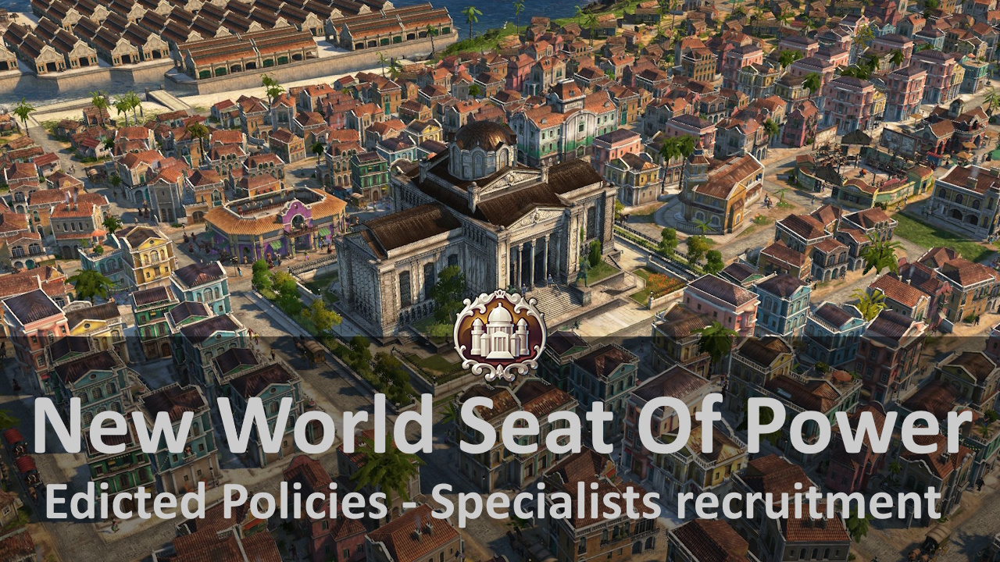

"Now that you've settled in, it's time to reinstate a regional administration. And what could be stronger than building a government for that purpose?"

## Requirements

You need `Seat Of Power` DLC to use this mod.

You don't need `Seed Of Change` and `New World Rising`, but this mod also adds content for these DLCs.

## Content

It's a porting of the Old World ministry for the New World region. Policies are adapted accordingly for the needs of this region.

In addition, a specific palace has been added in the New World to make this region even more interesting.

## Known Issues

- The NW ministry interface always shows information relating to the OW. **Rely on the effects which will be indicated in the town halls, trades unions, harbour master's offices, residences and public buildings. It is not possible to modify it for technical reasons. **If you want to have the changes outside the game, refer to this [part](../docs/decrees.md).**
- The `Cultural Outreach Act` decree will be of no use in this region at the moment.
- The `Art Fairs Act` does not provide influence for obreros at the moment.
- The passive productivity deparment effect has currently an issue.

## Compatibility
Fully compatible with:
-  Jakob's `New World Cities` mod.
- If any other mods require compatibility, please let me know.

## Credits

Thanks to the Anno modding community, especially HierOnimus for the modding tutorials, Kurila for being so patient with my questions and Lion for trying out approaches with custom infotips.